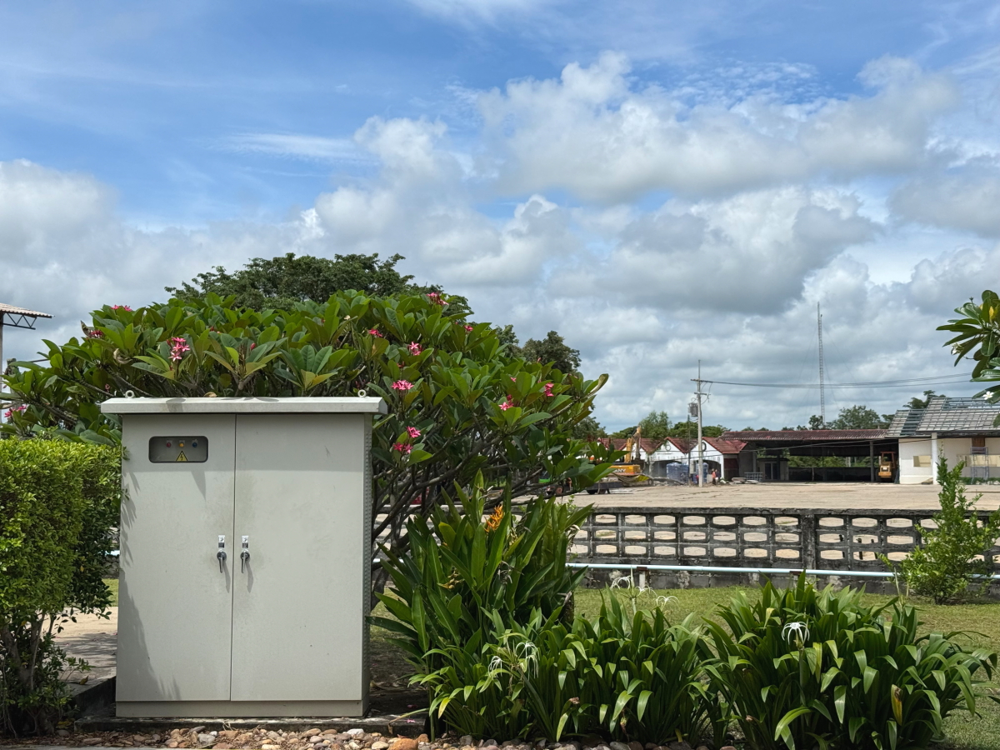
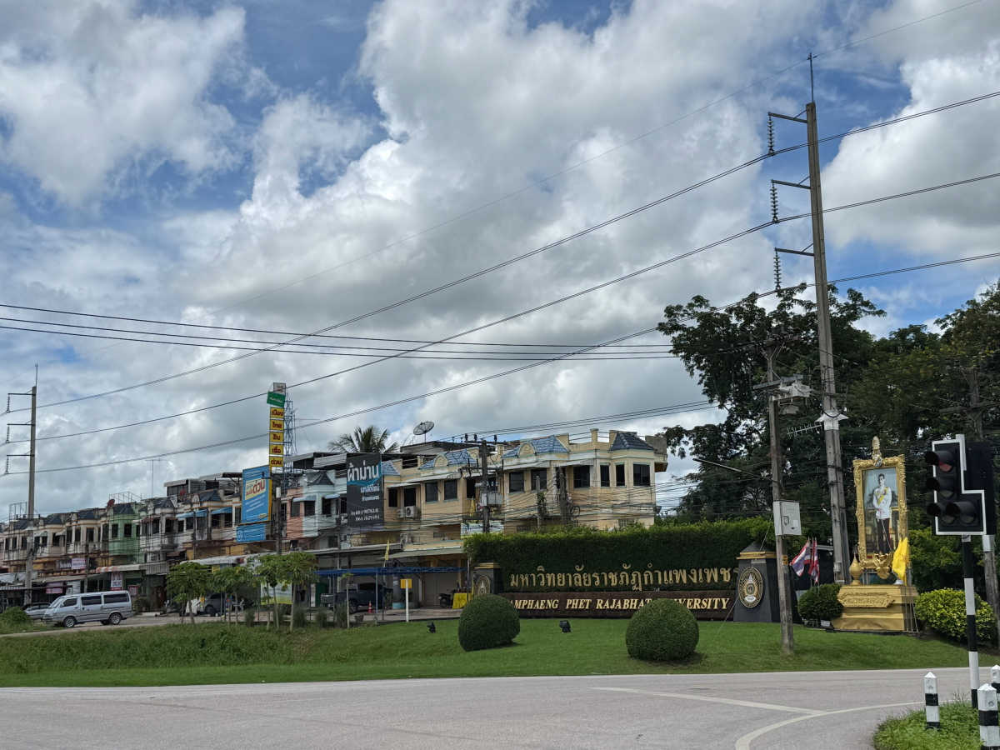
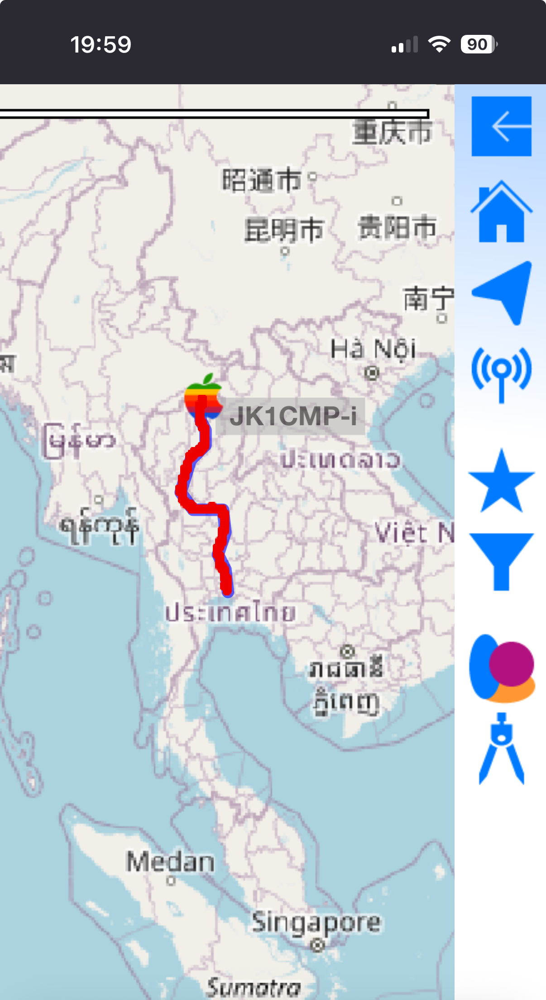

# 20250922_maechan

<html lang="ja" data-loaded="false" data-scrolled="false" data-spmenu="closed">
<head>

<meta charset="UTF-8">
<meta http-equiv="Content-Type" content="text/html; charset=UTF-8">
<meta http-equiv="X-UA-Compatible" content="IE=EmulateIE10" />
<meta http-equiv="X-UA-Compatible" content="IE=edge">

<meta name="viewport" content="width=device-width, initial-scale=1.0">

<!--ここから上はお決まりの定型文です-->

<!--ここからが表現の書式などを決めるcssという部分-->

<link href="https://cdnjs.cloudflare.com/ajax/libs/lightbox2/2.7.1/css/lightbox.css" rel="stylesheet">

</head>

<body>

モバイル端末をお使いの場合は、画面を横向きにすると
背景画像の横方向がご覧頂けます。

<!--ここ上は、ほぼそのまま使います！-->

<!--QRコードの挿入例-->

 アクセス用QRコード

<marquee direction="left" scrollamount="20" width="30%">(^_^)/~alis</marquee>

<!--流れ文字の挿入例-->
<h1><marquee behavior="left">!!! 2025/09/20-21、いつものショッピングモールから、チェンライに移動まで!!!</marquee></h1>

                          

<!--ここから下が、本体部分-->
    

 
<h2>20日、いつものショッピングモール、立体駐車場に停めたので場所を記録、4階フロアになりました</h2>

    
<h2>中央広場の遊園地で遊ぶ子供達</h2>

<iframe width="560" height="315" src="https://www.youtube.com/embed/HOiHUSKtu_I?si=S81LU1EvQ6_gadHj" title="YouTube video player" frameborder="0" allow="accelerometer; autoplay; clipboard-write; encrypted-media; gyroscope; picture-in-picture; web-share" referrerpolicy="strict-origin-when-cross-origin" allowfullscreen></iframe>
    

    
<h2>4階のフードコートでお昼ご飯</h2>

    
<h2>土曜日は流石に混んでます</h2>

    
<h2>2人分で140バーツ ≒ 600円</h2>

    
<h2>各フロアともそこそこの人出</h2>

    
<h2>海鮮レストランの入り口にはカニのディスプレー</h2>

    
<h2>まだ泡を吹いてます</h2>

    
<h2>バンコクの雑踏、この季節にしては珍しく青空</h2>

    
<h2>お隣のショッピングモール「パラダイスパーク」に移動、円が安いままです</h2>

    
<h2>入り口イベントホールには出店が出てました</h2>

    
<h2>21日、朝から北のチェンライに移動します、バンコクの空はしばらく見納め</h2>

    
<h2>バンコク市街を抜けた田舎のガソリンスタンド</h2>

    
<h2>スタンドにはコンビニが必ず併設されています</h2>

    
<h2>田舎の道をひたすら北上</h2>

    
<h2>この状態で100Km/hオーバーでクルーズしてます</h2>

    
<h2>スタンド内の生垣にはお花が満開</h2>

    
<h2>スタンドの人形が遠くから見えるように、巨大です</h2>

    
<h2>仏壇もかなり綺麗</h2>

    
<h2>大きな町を通過しながら北上します</h2>

    
<h2>12時すぎたのでお昼をいただきました</h2>

    
<h2>周辺は田園地帯が広がります</h2>

    
<h2>移動途中のお昼はこんな感じ、40バーツ ≒ 200円弱</h2>

    
<h2>平たい荷台に座っただけで移動するミャンマー人達</h2>

    
<h2>移動完了、晩御飯をいただきました</h2>

    
<h2>21日、全移動経路は約1000Km、12時間ほどかかりました、体が車の一部になった感じ・・・</h2>

    

         

<!--  
<h2>再掲【暑中お見舞い（ほたる）】LINEでご挨拶・動画で送る夏のグリーティングカード / ギターbgm/蛍の光・癒し動画</h2>

<iframe width="560" height="315" src="https://www.youtube.com/embed/Z4PKDOhRzfI?si=LaAJ8dA-1izGspEO" title="YouTube video player" frameborder="0" allow="accelerometer; autoplay; clipboard-write; encrypted-media; gyroscope; picture-in-picture; web-share" referrerpolicy="strict-origin-when-cross-origin" allowfullscreen></iframe>
    
   
-->   
    
    

  
<h2>今日のBGMは 【ストリートピアノ】ひこうピシリーズ第２弾(その２)　魔女の宅急便の『 海の見える街 』を弾いていたら聴いてくれていたオシャレなお姉さんに久石譲さんが降臨しちゃった！？</h2>

<iframe width="560" height="315" src="https://www.youtube.com/embed/eYw854lJrCo?si=cvTg-WVZzoxdS9O4" title="YouTube video player" frameborder="0" allow="accelerometer; autoplay; clipboard-write; encrypted-media; gyroscope; picture-in-picture; web-share" referrerpolicy="strict-origin-when-cross-origin" allowfullscreen></iframe>
    

    
  
<h2>8月17日にメタバースで披露されたまいてゃさんの新曲「Lonely game」</h2>

<iframe width="560" height="315" src="https://www.youtube.com/embed/HstFJ2_8oQA?si=QrYNv_EcIm7fALkV" title="YouTube video player" frameborder="0" allow="accelerometer; autoplay; clipboard-write; encrypted-media; gyroscope; picture-in-picture; web-share" referrerpolicy="strict-origin-when-cross-origin" allowfullscreen></iframe>
    

    
    

    
    
    <h3>「雪の中で輝くシンデレラ」by まいてゃ</h3>
<h2><a href="https://torokoid.github.io/20250219_chiangrai/maitiyaz.mp3" target="_blank">この文字クリックで再生します 下の再生ボタンでも同じ曲をループ再生します</a></h2>

    <audio controls loop>
        <source src="https://torokoid.github.io/20250219_chiangrai/maitiyaz.mp3" type="audio/mpeg">
        お使いのブラウザは audio タグをサポートしていません。
    </audio>
 
    
<!--
  
<h2>スティーブ・ジョブズの伝説の講義</h2> 
<iframe width="560" height="315" src="https://www.youtube.com/embed/XsRpvWHIVw0?si=f7IA0pv9iZWVk3VH" title="YouTube video player" frameborder="0" allow="accelerometer; autoplay; clipboard-write; encrypted-media; gyroscope; picture-in-picture; web-share" referrerpolicy="strict-origin-when-cross-origin" allowfullscreen></iframe>    
    
    
<h2>スティーブ・ジョブズ氏の講義の内容が「笑って死ぬ」by まいてゃ さんの歌の内容と大筋で同じに聞こえます 以下に再掲しますね</h2>

    
<h3>歌の後半部分しか撮れてませんが、2月16日のイベントで公開された「笑って死ぬ」 by まいてゃ 白ドレスはダンサーの玖遠さん、黒いドレスがまいてゃさん</h3>
<iframe width="560" height="315" src="https://www.youtube.com/embed/s4ZcbxAluMM?si=Xa32xo19UCNaWv0v" title="YouTube video player" frameborder="0" allow="accelerometer; autoplay; clipboard-write; encrypted-media; gyroscope; picture-in-picture; web-share" referrerpolicy="strict-origin-when-cross-origin" allowfullscreen></iframe> 
-->
    

    <h3>お気に入りの「笑って死ぬ」 by まいてゃさんも再々掲です</h3>
<h2><a href="https://torokoid.github.io/20250221_chiangrai/maitiya3.mp3" target="_blank">この文字クリックで再生します 下の再生ボタンで同じ曲をループ再生します</a></h2>

    <audio controls loop>
        <source src="https://torokoid.github.io/20250221_chiangrai/maitiya3.mp3" type="audio/mpeg">
        お使いのブラウザは audio タグをサポートしていません。
    </audio>

   
<h2>以上、いつものショッピングモールから、チェンライに移動まででした。 ここまでご覧いただきありがとうございました。</h2>

     
<h2>
<a href="https://torokoid.github.io/Mashiko_himawari_3/" target="_blank">クリックでメニューページに戻ります</a>
</h2>

   

<!-- hitwebcounter Code START -->
<a href="https://www.hitwebcounter.com" target="_blank">

あなたは 番目の訪問者です 数値は8月1日以降に立ち上げたバンコク・パタヤ・メーチャンシリーズHPの累計です
</a>   

         

  

      

<!--本体はここまで-->

<!--画面に空白地帯を作って、背景が見えるようにしています-->
                                              

<!-- フッタ -->
<footer>

Copyright 2025/09/22 alis @Mae Chan

</footer>

<!--HPにさまざまなJavaScriptを呼び込むための書式-->

    
    </body>
    
</html>
